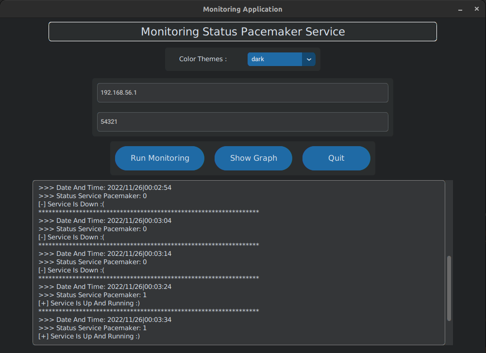
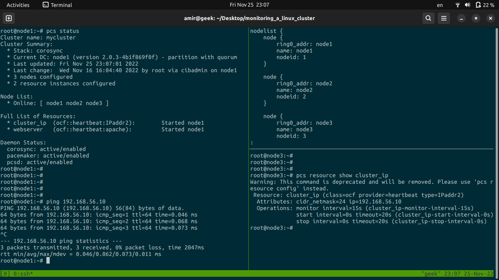

<div style="text-align: center;">

# A program to monitor a Linux cluster with Python

</div>


`Bachelor software project`

## Overview of the program:



---

## Project description:

In the initial step, I provisioned three virtual nodes running Ubuntu 20.04 using Vagrant. Each node was configured with the necessary system dependencies to support high-availability clustering. Once the virtual machines were set up, I configured a high-availability cluster using Corosync for cluster communication and Pacemaker for resource management.

The cluster manages two essential resources:
1. A Virtual IP Address: This floating IP ensures continuous accessibility to the cluster, regardless of which node is currently hosting the resources.
2. An Apache Web Server: This service is responsible for serving the desired website, ensuring high availability of web content.

To ensure fault tolerance, Corosync is configured to handle node communication and failure detection, while Pacemaker manages automatic failover. If a node hosting the resources fails or becomes unreachable, Pacemaker detects the failure and seamlessly migrates the resources to another healthy node. This failover mechanism minimizes downtime and maintains service availability without requiring manual intervention.

Additionally, I configured STONITH (Shoot The Other Node in The Head) to prevent split-brain scenarios, ensuring that failed nodes do not cause conflicts within the cluster. The resource constraints and failover policies were fine-tuned to optimize load balancing and recovery speed.

By using Vagrant, I was able to automate the deployment of virtual machines, making it easy to test and refine the cluster configuration in a controlled environment before deploying it in a production setup. This approach ensures that the high-availability cluster is both scalable and resilient, capable of handling node failures while maintaining uninterrupted service delivery.



The program I wrote and implemented monitors the status of the Pacemaker service using Socket programming. If the service stop working, it sends an email.

Service status is received as zero or one values. These values are stored in the MySQL database. And also using the Matplotlib library, its graph is drawn at the end.


---

## How to run the project:

1. clone the repository
```
git clone https://github.com/amirmohammadre/monitoring_a_linux_cluster.git
```

2. cd to directory desired and run this command
```
vagrant up
```

3. Checking the status of nodes 
```
vagrant status
```

4. ssh to node desired for example:
```
vagrant ssh node1
```

5. transfer file Client.py to node favorite
```
scp Client.py root@192.168.56.10:/home/vagrant
```

6. first run file Server.py and input ip address and port   then file Client.py run on node favorite
```
python3 Server.py

python3 Client.py
```

---

## Contact:

- Amir mohammad Rezvaninia - [LinkedIn](https://www.linkedin.com/in/amirmohammadrezvaninia/) 

- Email Address: amirmohammadrezvaninia@gmail.com

- Project Link: [https://github.com/amirmohammadre/monitoring_a_linux_cluster](https://github.com/amirmohammadre/monitoring_a_linux_cluster)

---

## :man_technologist: support project:	
If you like the project, give it a :star: ;)
